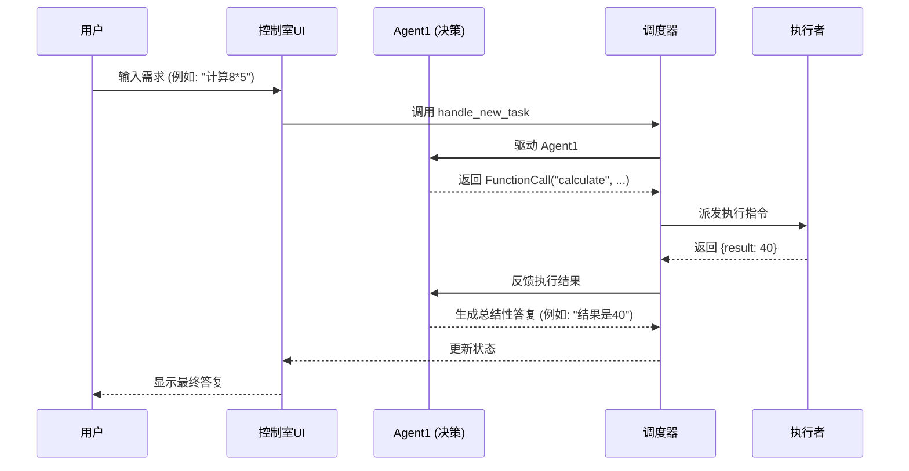
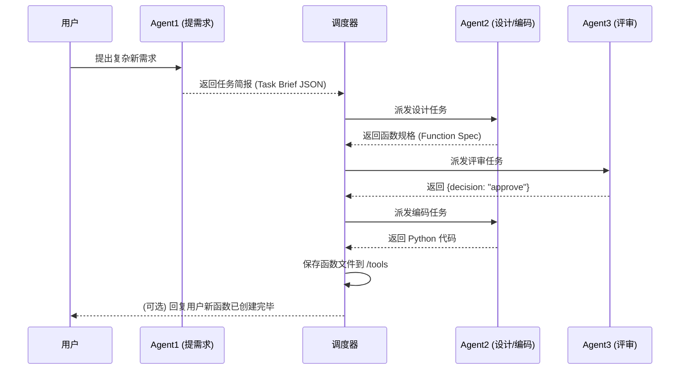

# 系统架构与角色定义

## 1. 系统概述

本系统是一个高级的多智能体（Multi-Agent）协作框架，其核心目标是围绕“工具（函数）”的**使用**与**创造**，来自动化地满足用户的各类需求。系统通过将不同职责（决策、设计、评审、执行）分配给专门的智能体和组件，形成一个清晰、健壮且可扩展的工作流。

## 2. 核心组件

系统由以下几个核心组件构成：

### 2.1. Top-Level Orchestrator (调度器 / “总指挥”)

- **角色定位**：整个系统的大脑和指挥中心。
- **核心职责**：
    - 接收用户的原始请求。
    - 管理和维护任务的完整生命周期和状态（`TaskContext`）。
    - 根据任务状态，按顺序调用和驱动其他智能体（Agent）或组件（Worker）。
    - 在不同组件之间传递所需的数据和上下文。

### 2.2. Agent1 (决策智能体 / “一线客服”)

- **角色定位**：直接面向用户，负责理解用户意图并做出初步决策的“前端”智能体。
- **核心职责**：
    - 与用户进行多轮对话，澄清模糊的需求。
    - **决策**：判断满足用户需求的最佳路径。
- **输入**：用户的实时请求、完整的对话历史、知识库快照（可选）。
- **输出（三选一）**：
    1.  **函数调用 (FunctionCall)**：当发现有现成的工具可以使用时。
    2.  **任务简报 (Task Brief)**：当需要创造一个新工具时，输出一个结构化的 JSON，描述需求。
    3.  **聊天文本 (Text)**：当需要向用户提问或进行普通交流时。

### 2.3. Agent2 (工具工程师 / “后端程序员”)

- **角色定位**：负责工具的具体设计与实现的“技术”智能体。
- **核心职责**：
    - **设计**：接收 Agent1 的“任务简报”，设计出符合规范的函数规格（`Function Spec`），包括名称、描述、参数、返回值等。
    - **实现**：在函数规格通过 Agent3 的审查后，编写高质量、可执行的 Python 代码。
- **输入**：Agent1 生成的“任务简报”、Agent3 的修改反馈。
- **输出**：函数规格 (JSON)、Python 函数代码 (String)。

### 2.4. Agent3 (质量保证与资产管控 / “代码审查官”)

- **角色定位**：负责保障工具质量和管理函数库的“审计”智能体。
- **核心职责**：
    - **审查**：严格审查 Agent2 提交的函数设计规格，确保其清晰、健壮、可维护。
    - **决策**：给出 `approve` (批准), `revise` (要求修改), 或 `reject` (拒绝) 的结论。
    - **治理**：(高级功能) 监控已入库函数的运行状况，对于反复出错的函数，可以发起“修复”或“弃用”流程。
- **输入**：Agent2 设计的函数规格。
- **输出**：包含审查结论和修改意见的 JSON 对象。

### 2.5. Worker (执行者)

- **角色定位**：一个纯粹、安全的代码执行环境。
- **核心职责**：
    - 接收调度器派发的函数执行指令（函数名和参数）。
    - 在一个受控的（`try...except`）环境中**安全地**执行函数。
    - **不关心**业务逻辑，只负责执行与汇报。
- **输入**：函数名、函数参数。
- **输出**：包含 `result` (成功时) 或 `error` (失败时) 的结果字典。

## 3. 核心工作流

### 3.1. 工作流 A：函数执行（使用已有工具）

此流程的目标是利用现有工具快速满足用户需求。

- **错误处理**：如果 Worker 在执行步骤中捕获到异常，它会返回 `{error: ...}`。调度器同样会将这个错误信息反馈给 Agent1，Agent1 在理解错误后，会生成一句人性化的错误解释（例如“除数不能为零”）返回给用户。

### 3.2. 工作流 B：函数创造（创建新工具）

此流程的目标是当现有工具无法满足需求时，创造一个全新的工具并存入函数库。

